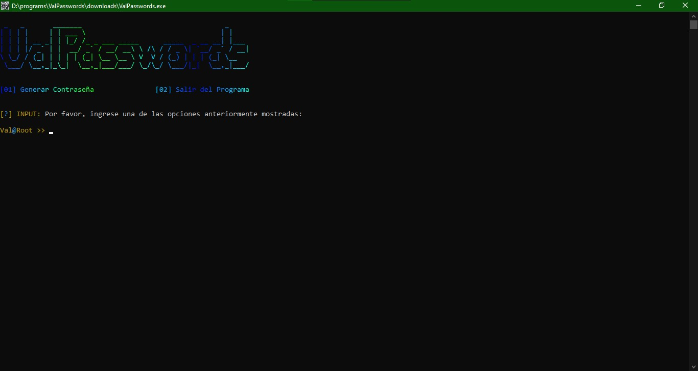

<h1>🦈 * ValPasswords</h1>

<h3>📍 * Función</h3>

Generador de contraseñas seguras escrito en Python 3.

<h3>📍 * Instalación</h3>

Puedes clonar el repositorio usando <i>git clone</i> o puedes <a href="https://github.com/StevenNinex/ValPasswords/raw/refs/heads/main/program/downloads/ValPasswords.exe">Descargar</a> un ejecutable.

<h3>📍 * Contacto</h3>

Creado por <a href="mailto:ForUseAF@proton.me">Steven</a>

